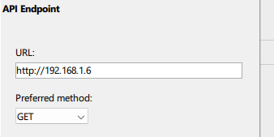

# examples-arduino-led-blink

Simple example on how to control an LED using ESF Blink Tracker and an ESP32 or Arduino microcontroller.


The code starts a HTTP server that is accessible over your home WiFi 
and flashes the builtin led every time the app detects that your eyes are blinking. 


1. Edit the ino file with your WLAN credentials:
```
const char* ssid = "YourSSID";
const char* password = "YourPassword";
```

2. Once the server has started it prints the IP it is listening on to the serial monitor.
Enter the IP under Settings, Api-Endpoint.




## API

https://blinktracker.app/docs/api
